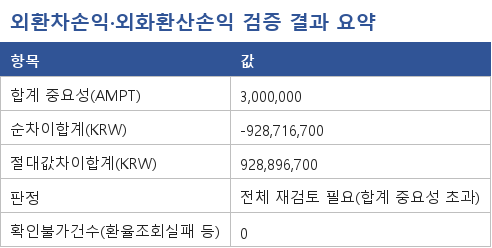
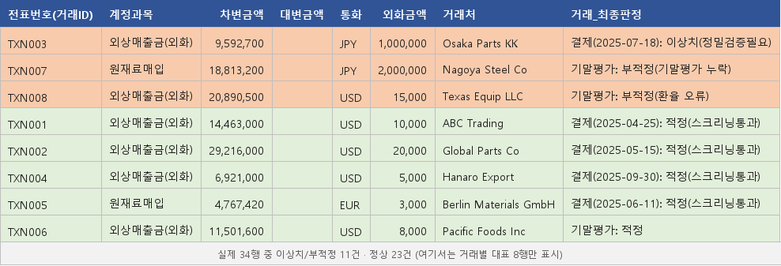

# 외환차손익 · 외화환산손익 검증 자동화 도구


**분개장(회계 전표 목록) / 명세서(외화자산부채명세서, 외화 잔액 상세) / 계정별원장(계정과목별
잔액)**, 이 세 파일을 넣으면 결산 시점에 반영된 **외환차손익**(외화 거래를 실제로 결제했을 때
생기는 손익)과 **외화환산손익**(아직 결제 안 된 외화 자산·부채를 기말 환율로 다시 계산했을 때
생기는 손익)이 맞게 처리됐는지 자동으로 확인하는 감사 도구입니다.

파트타임 감사 실무 중 직접 했던 일 — *"표본을 뽑아 증빙(은행 외환거래확인서 등)을 하나하나
대조하며 회사가 쓴 환율과 외환차손익이 맞는지 확인하는 작업"* — 을 자동화하는 데서
출발했습니다.

**문제**: 감사인은 결제 건마다 증빙을 열어 환율을 눈으로 대조하는 반복 작업에 시간을 씁니다.
**해결**: 전체 거래를 자동으로 훑어서 이상한 것만 골라내고, 그 건만 증빙을 대조합니다.
**결과**: 감사인은 반복 대조 대신 문제 있는 건 검토와 최종 판단에 집중할 수 있습니다. 실제로
어떤 오류를 어떻게 잡아내는지는 [실행 예시](#실행-예시)에서 바로 확인할 수 있습니다.

## 실행 예시

아래는 `sample_data/`를 대상으로 실제 실행한 결과입니다(EXIM_AUTH_KEY로 조회한 실제
매매기준율 기준). 결과 엑셀의 "요약"·"A.표본전체상세" 시트는 이렇게 보입니다 — 이상치/부적정
행은 빨간색, 적정 행은 초록색으로 자동 하이라이트됩니다:





전체 결과 파일은
[`sample_data/검증결과_예시.xlsx`](sample_data/검증결과_예시.xlsx)에서 확인할 수 있습니다
(GitHub 화면에서는 엑셀 파일을 미리보기로 보여주지 못해 "View raw"만 뜹니다 — 다운로드하거나
"Download raw file" 아이콘으로 받아서 Excel로 열면 정상적으로 보입니다).

```
=== 요약 (합계 중요성 판정) ===
합계 중요성(AMPT): 3,000,000
절대값차이합계(KRW): 928,896,700
판정: 전체 재검토 필요(합계 중요성 초과)
확인불가건수: 0

=== A. 외환차손익 (결제 건) ===
TXN001 USD  적정(스크리닝통과, 괴리 0%)        기준일판정: 정상(결제일 환율 사용 확인)
TXN002 USD  적정(스크리닝통과, 괴리 1.6%)      기준일판정: 기준일 오류 의심 - 2025-04-30 환율을 사용한 것으로 보임
TXN003 JPY  이상치(정밀검증필요, 괴리 9,900%)  차이(KRW): -928,352,700  ← 100엔 단위 나누기 누락
TXN004 USD  적정(스크리닝통과, 괴리 0%)        차이(KRW): 90,000        ← 합계 중요성에서 포착(외환차익 계상 누락)
TXN005 EUR  적정(스크리닝통과, 괴리 0%)        기준일판정: 정상(결제일 환율 사용 확인)

=== D. 외화환산손익 (기말 미결제 건) ===
TXN006 USD  적정
TXN007 JPY  부적정(기말평가 누락)
TXN008 USD  부적정(환율 오류) - 회사 1,470.00 vs 공식 1,434.90

=== E. 완전성검증 (계정별원장 대사) ===
907 외환차익    부적정(분개장-원장 불일치) - 분개장 928,240,800 vs 원장 928,290,800 (수기조정 미반영)
957/908/958    적정

=== E. 거래처별 롤포워드 검증 ===
Hanaro Export(USD)만 불일치(차이 -90,000) - TXN004의 외환차익 계상 누락과 동일 건
```

1단계 개별 괴리율 기준(5%)만으로는 TXN002·TXN004처럼 금액이 작거나 다른 계정에 묻혀버린
오류는 통과해버리지만, 합계 중요성(AMPT) 확인과 계정별원장 대사가 이를 정확히 잡아내는 것을
확인할 수 있습니다. `sample_data/검증포인트_참고용.xlsx`에 정리된 일부러 넣은 오류 5건
(TXN002·003·004·007·008)이 전부 어떤 형태로든 걸리고, 정상 케이스(TXN001·005·006)는
false positive 없이 통과했습니다.

## 용어 설명

아래 표에 없는 용어는 본문에서 나올 때 바로 풀어서 씁니다.

| 용어 | 쉬운 설명 |
|---|---|
| 매매기준율 | 한국수출입은행이 매일 발표하는 "공식" 환율. 은행 거래의 기준이 되는 환율입니다 |
| 내재환율 | 분개에 찍힌 원화금액 ÷ 외화금액으로 거꾸로 계산한, 회사가 실제로 쓴 환율입니다 |
| 괴리율 | 회사가 쓴 환율과 공식 환율이 몇 % 차이 나는지를 뜻합니다 |
| 이상치 | 괴리율이 기준(기본 5%)을 넘어서, 자세히 들여다봐야 하는 거래입니다 |
| 중요성(AMPT) | "이 정도 금액 차이는 넘어가도 되는 선"으로 감사팀이 미리 정해두는 금액입니다 |
| 완전성 | 있어야 할 거래·계정이 하나도 빠짐없이 다 반영됐는지를 뜻합니다 |
| 대사 | 서로 다른 두 장부(예: 분개장과 원장)의 숫자가 맞는지 맞춰보는 작업입니다 |
| 롤포워드 | "기초 잔액 + 이번에 생긴 것 − 이번에 없어진 것 = 기말 잔액"이 맞는지 검산하는 방법입니다 |
| 위음성 | 실제로는 문제가 있는데 "문제없음"으로 잘못 판정하는 것을 뜻합니다 |
| 전신환매매율 | 은행이 외화를 전신(TT) 송금으로 사고팔 때 적용하는 환율로, 수출입은행이 매일 고시하는 매매기준율의 산출 기준이 되는 시장 환율입니다 |
| 우대환율 | 거래 규모나 은행과의 관계에 따라 매매기준율보다 유리하게 적용받는 환율. 공식환율과 회사 환율이 달라도 정당한 우대환율일 수 있어, 실제 원인은 증빙으로 확인해야 합니다 |
| SWIFT 통지서 | 은행 간 국제송금·외환거래 내용을 표준 전문(SWIFT MT 메시지) 형식으로 전달·출력한 문서. 이 도구의 2단계 OCR 검증에서 증빙 이미지로 흔히 쓰입니다 |

## 왜 이렇게 설계했는가

외화환산손익(기말 재평가)과 외환차손익(결제 시점 손익)은 확인하는 방법이 근본적으로
다릅니다.

- **외화환산손익**: 결산일에는 공식 환율(매매기준율)이 딱 하나뿐이라서 "정답"이 하나로
  정해집니다. → 전체 거래를 자동으로 확인할 수 있습니다.
- **외환차손익**: 실제 결제는 은행·계좌마다 조건이 달라서(전신환매매율, 우대환율 등) 적용되는
  환율이 제각각입니다. 미리 정해진 "정답 환율"이 없고, 증빙을 봐야만 회사가 실제로 어떤
  환율을 썼는지 알 수 있습니다. → 전체를 다 증빙 대조하는 대신, **이상한 거래만 자동으로
  골라내고(1단계 스크리닝) 그 거래에 대해서만 증빙을 대조하는(2단계)** 구조로 만들었습니다.

### 전제 조건

이 도구는 **회사가 "결제일의 한국수출입은행 매매기준율을 쓴다"는 환율 정책을 따른다**고
가정하고 만들었습니다. 그래서 매매기준율과 많이 차이 나면(기본 5% 이상, `TOLERANCE_PCT`)
이 정책을 안 지켰을 가능성이 있는 이상치로 봅니다. 전신환매매율이나 우대환율처럼 다른 환율을
정책으로 쓰는 회사라면, 비교 기준 자체(매매기준율 조회 로직, `TOLERANCE_PCT`)를 그 회사
정책에 맞게 바꿔야 합니다.

### 전체 흐름

```
분개장 + 명세서 + 계정별원장
        │
        ▼
[0] 거래처별 연간 요약 + 월별 환율 추이 (분석적 절차)
    실제 감사에서는 거래를 한 줄씩 보기 전에 거래처별 연간 손익 요약과
    월별 환율 추이를 먼저 검토하여, 이상 수치가 발견되는 거래처·시점만 세부 검토(드릴다운)합니다.
        │
        ▼
[A] 외환차손익 (결제 건)                    [B] 외화환산손익 (기말 미결제 건)
        │                                           │
  1단계: 전수 스크리닝                        결산일 공식환율로
  회사 적용환율(내재) vs                      전수 자동 재계산·검증
  공식 매매기준율(수출입은행 API)                    │
  괴리율 5% 초과 → 이상치 플래그               (재평가 누락 건도 명세서 대조로 자동 탐지)
        │
  보조1: 합계 중요성(AMPT) 검증
  개별 통과 건도 재계산-계상액 차이를 전부 합산해
  허용가능 오류금액 초과 여부 확인
        │
  보조2: 결제일-환율기준일 불일치 탐지
  "전월말 환율을 잘못 썼다" 같이 크기는 작아도
  실제로는 다른 날짜 환율과 정확히 일치하는 경우를 탐지
        │
  2단계: 이상치 건만 증빙(은행 외환거래확인서 등 이미지)을
  Claude Vision으로 읽어 실제 적용환율 추출 → 최종 대사

[C] 계정별원장 대사
    분개장에서 집계한 외환차익/차손/외화환산이익/손실 계정 합계가
    총계정원장 잔액과 일치하는지 확인 (수기 조정분 누락 등 완전성 이슈 탐지)
```

### 실무 감사 절차와의 대응

각 단계는 새로 지어낸 로직이 아니라, 사람이 손으로 하던 감사 절차를 그대로 자동화한
것입니다.

| 파이프라인 단계 | 사람이 손으로 할 때 |
|---|---|
| 0단계 분석적 절차 | 거래처별 연간 손익 요약과 월별 환율 추이를 엑셀로 훑어보며 이상한 시점을 찾음 |
| 1단계 스크리닝 | 표본 거래를 뽑아 환율 고시표와 하나씩 대조 |
| 합계 중요성(AMPT) 검증 | 건별로는 사소해 보이는 차이를 전부 더해서 중요성 기준과 비교 |
| 2단계 증빙 OCR | 은행 외환거래확인서·SWIFT 통지서를 열어 환율을 직접 읽고 대조 |
| 계정별원장 대사 | 분개장 합계와 시산표(총계정원장)를 손으로 맞춰보는 절차 |
| 롤포워드 검증 | 거래처별 기초-발생-기말 잔액을 손으로 검산 |

## 처리 가능한 실무 케이스

- **분할결제**: 한 거래가 여러 날짜에 나눠 결제되는 경우, 결제 건별로 정확히 나눠서 인식
- **지저분한 원본 파일**: 제목행·빈행이 표 위에 섞여 있어도 헤더를 자동으로 찾고, 계정코드
  형식이 섞여 있거나("108.0" 등), 계정과목명 앞뒤에 공백이 있거나, 통화 코드 대소문자가
  섞여 있거나, 숫자가 텍스트로("15,000") 들어와 있어도 자동으로 정리
- **전표번호 중복(오채번, 전표번호를 잘못 매긴 경우)**: 같은 거래ID에 서로 다른 통화·거래처가
  섞여 있으면 경고를 띄우고, 명세서와 교차 확인해서 실제 문제를 놓치지 않음
- **회사마다 다른 계정명·계정코드**: 건설업 현장별·국가별·본지점별로 계정이 쪼개진 경우도
  키워드로 자동 분류해서 대응 (아래 "계정매핑" 참고)
- **전표번호가 아예 없는 원본**: 차변=대변=0이 되는 지점을 기준으로 전표번호를 자동으로 매김
- **100만 달러를 10번에 나눠 갚은 것처럼 발생-결제를 1:1로 짝짓기 어려운 경우**: 거래ID로
  짝짓지 않고도 거래처별 잔액 증감(롤포워드)만으로 총액이 맞는지 확인 가능
- **다양한 통화**: USD/JPY/EUR/CNH 외에도 GBP/HKD/CHF/CAD/AUD/SGD를 지원하며, 등록 안 된
  통화가 들어오면 조용히 넘어가지 않고 "통화코드 매핑 미등록"이라고 명확히 표시
- **환율 조회 실패에도 잘 버팀**: API 키 미설정, 휴장일 5영업일 초과, 인증키 오류 등으로
  특정 거래 하나의 환율을 못 찾아도 그 거래만 "오류(환율조회실패)"로 남기고 나머지 거래
  확인은 계속 진행 (한 건 오류로 전체가 멈추지 않음)

## 핵심 설계 포인트

- **분개장의 "적용환율" 칸을 그대로 믿지 않음**: 이 칸이 잘못 적혀 있어도 놓치지 않도록,
  실제로 찍힌 원화금액 ÷ 외화금액으로 **회사가 진짜로 쓴 환율(내재환율)을 거꾸로 계산**해서
  비교합니다.
- **건별로도 보고, 전체 합계로도 봄**: 괴리율이 낮아도(예: 1.6%) 거래 금액이 크면 차액이
  커질 수 있어서, 건별로 통과한 것도 전부 더해서 중요성 기준(AMPT)으로 다시 확인합니다.
- **JPY(엔화) 100엔 단위 처리**: 수출입은행 API는 엔화를 100엔당 가격으로 발표합니다. 이걸
  나누는 걸 깜빡해서 약 100배 잘못 계산하는 실수를 잡아내는 로직이 들어 있습니다.
- **AI는 꼭 필요한 곳에만**: 계산으로 판단할 수 있는 부분(환율 재계산, 괴리율, 합계 확인)은
  전부 일반 로직으로 처리하고, **서식이 제각각인 증빙 문서를 읽는 부분에만** Claude Vision을
  썼습니다.
- **짝짓기가 필요 없는 확인은 짝짓기에 기대지 않음**: 발생-결제 거래를 1:1로 짝짓기 어려운
  경우(분할상환 등)에도, 재고자산 롤포워드와 같은 방식(기초+발생-기말=소멸)으로 거래처별
  합계만 맞는지 확인하는 별도 절차를 뒀습니다.

### Claude(AI)의 역할

AI는 계산만으로는 판단할 수 없는 지점에만 썼고, 나머지는 전부 일반 로직입니다.

| 단계 | AI 사용 여부 |
|---|---|
| 1단계 스크리닝 / 합계 중요성(AMPT) / 기준일 불일치 탐지 | 사용 안 함 — 환율 재계산·괴리율·합계는 전부 계산으로 처리 |
| 2단계 증빙 OCR | Claude Vision 사용 — 서식이 제각각인 증빙 이미지에서 거래일자·통화·적용환율·금액을 읽어냄 |
| 감사조서(Word) 자동생성 | 사용 안 함 — 이미 계산·판정된 값을 문서 형식으로 옮겨 적을 뿐, 새로운 판단(중요성 판단 등)은 하지 않음 |

## 사용 방법

### 1. 환경 준비
```bash
pip install -r requirements.txt
```

### 2. 인증키 발급
- **한국수출입은행 환율 API**: [data.go.kr](https://www.data.go.kr/data/3068846/openapi.do)
  또는 [수출입은행 Open API](https://www.koreaexim.go.kr/ir/HPHKIR020M01) 에서 무료 발급
- **Anthropic API 키** (2단계 증빙 OCR용): [console.anthropic.com](https://console.anthropic.com)

### 3. 환경변수 설정
```bash
export EXIM_AUTH_KEY="발급받은_인증키"
export ANTHROPIC_API_KEY="발급받은_API_키"
```

### 4. 실행
```bash
python3 fx_verification_pipeline.py
```

인자 없이 실행하면 `sample_data/` 폴더의 샘플 분개장·명세서·계정별원장을 대상으로 동작합니다.
실제 회사 파일로 확인하려면 아래처럼 CLI 인자로 파일 경로와 결산 조건을 지정하세요. 분개장은
`REQUIRED_JOURNAL_COLUMNS`로 헤더 행을 자동 인식하고, 명세서·계정별원장은 별도 상수 없이
아래 표의 컬럼명이 코드에서 직접 조회됩니다(1행이 헤더여야 하며, 컬럼 순서는 상관없습니다):

**분개장** (`REQUIRED_JOURNAL_COLUMNS` — 이 5개로 헤더 행을 자동 탐지하므로, 제목행/빈행이
위에 섞여 있어도 무방합니다)

| 컬럼명 | 왜 필요한가 |
|---|---|
| 전표번호(거래ID) | 거래 식별 키(헤더 자동인식 기준) |
| 일자 | 거래일자(헤더 자동인식 기준) |
| 구분 | "발생"/"결제"/"기말평가" 구분(헤더 자동인식 기준, 파이프라인이 이 값으로 분기) |
| 계정코드 | 계정 분류·원장 대사(헤더 자동인식 기준) |
| 계정과목 | 계정명(헤더 자동인식 기준) |
| 통화 | `load_journal()`에서 곧바로 읽어 정규화(없으면 즉시 오류) |
| 차변금액, 대변금액 | 원장 대사, 롤포워드 검증, 전표번호 자동채번에 필요 |
| 거래처 | 거래처별 분석적 절차·롤포워드 검증에 필요 |
| 적용환율 | 기말평가 라인 판정에 필요 (결제 건은 원화금액에서 내재환율을 역산하므로 참고용) |
| 외화금액 | 스크리닝 대상 거래(발생/결제/기말평가) 추출에 필요 |

**명세서(외화자산부채명세서)** (검증하는 상수 없이 아래 컬럼명을 코드가 직접 조회 — 없으면
`KeyError`가 납니다)

| 컬럼명 | 왜 필요한가 |
|---|---|
| 전표번호(거래ID) | 분개장과 매칭하는 키 |
| 통화 | 기말평가 누락 건 재구성 시 필요 |
| 기말미결제외화잔액 | 기말 재평가·재평가 누락 탐지 대상 판정 기준 |

**계정별원장** (마찬가지로 검증 상수 없이 아래 컬럼명을 직접 조회)

| 컬럼명 | 왜 필요한가 |
|---|---|
| 계정코드 | 907/957/908/958(외환차익/차손/환산이익/환산손실) 대사 대상 매칭 |
| 차변합계, 대변합계 | 분개장 집계액과 대사할 원장 금액 |

```bash
python3 fx_verification_pipeline.py \
  --journal 분개장.xlsx \
  --schedule 명세서_외화자산부채명세서.xlsx \
  --ledger 계정별원장.xlsx \
  --year-end-date 2025-12-31 \
  --output 검증결과.xlsx \
  --ampt 3000000   # 허용가능 오류금액(중요성 기준) - 실제 감사건 중요성 금액으로 교체
```
`--ampt`를 생략하면 `FX_AMPT` 환경변수(기본값 3,000,000)를 씁니다.

실행이 끝나면 콘솔 출력과 별도로 `검증결과.xlsx` 파일이 생깁니다 (아래 "결과 엑셀 시트 구성"
참고). 이상치·부적정 행은 빨간색, 적정 행은 초록색으로 표시되고 맨 위로 정렬되며,
차변금액·대변금액이 있는 시트에는 순액(차변-대변) 열이 자동으로 붙습니다.

### 5. 증빙 이미지로 2단계 검증
1단계에서 이상치로 표시된 거래에 대해, `evidence/{거래ID}.png` (또는 `.jpg`, `.pdf`) 형태로
은행 외환거래확인서·SWIFT 통지서 등을 넣어두면 자동으로 OCR 검증까지 진행됩니다.

OCR이 이미지를 잘 읽는지만 따로 확인하고 싶다면(예: 프롬프트를 고친 뒤 회귀 확인),
정답값이 정해진 가짜 증빙 이미지로 `extract_rate_from_evidence()`를 직접 불러보는 확인용
스크립트를 제공합니다. 실제 API를 호출하므로 pytest 자동 스위트에는 넣지 않았습니다.
```bash
python tests/generate_ocr_test_sample.py   # evidence/OCR_TEST_001.png 생성(최초 1회)
python tests/manual_ocr_check.py           # 실제 Claude Vision 호출 후 정답값과 비교
```

### 6. 회사마다 다른 계정명 대응 (계정매핑)
회사의 계정과목 목록(시산표 등)을 `['회사계정코드', '회사계정명']` 형태로 준비해
`build_account_mapping()`에 넣으면, 키워드로 1차 자동 분류하고 애매한 것만 "확인필요"로
표시합니다. 확인이 끝난 매핑은 `apply_account_mapping()`으로 분개장에 적용하면, 이후
파이프라인은 코드를 고치지 않아도 그대로 동작합니다.

### 7. 전표번호가 없는 원본 (전표번호 자동채번)
`auto_assign_voucher_number()`를 쓰면 차변=대변=0이 되는 지점까지를 전표 1건으로 자동으로
묶어 전표번호를 매깁니다. 순수 회계 규칙이라 사람이 따로 확인할 필요가 없습니다.

### 8. 감사조서 자동생성
`--workpaper` 옵션을 주면 `검증결과.xlsx`와 함께 감사조서 형식의 Word 문서
(기본 파일명 `감사조서_외환차손익.docx`, `--workpaper-output`으로 경로 변경 가능)도
만들어집니다. 옵션을 안 주면 기존과 똑같이 만들어지지 않습니다.
```bash
python fx_verification_pipeline.py --workpaper
```
회계법인 실무에서 쓰는 감사조서 표준 형식(목적 → 대상 → 절차 → 결과 → 결론)을 따릅니다.

| 구성 | 내용 |
|---|---|
| 1. 검증 목적 | 결산일 기준 외환차손익·외화환산손익이 맞게 처리됐는지 확인한다는 목적 |
| 2. 검증 대상 | 대상 거래처 수, 통화별 결제/기말미결제 건수와 외화금액 합계 |
| 3. 수행 절차 | 1단계 스크리닝 → 합계중요성(AMPT) → 기준일 불일치 탐지 → 2단계 증빙 OCR → 기말환산 검증 → 계정별원장 대사 → 롤포워드 검증 |
| 4. 검증 결과 | 전체 대상 건수, AMPT 초과 여부, 문제 있는 건(Exception)의 상세 표 |
| 5. 결론 | AMPT 초과 여부에 따른 "중요한 차이 발견됨/발견되지 않음" 및 문제 있는 건에 대한 추가검토 필요 문구 |

이 문서는 새로운 판단을 내리지 않고, `검증결과.xlsx`를 만들 때 이미 계산된 값과 판정
문자열을 그대로 옮겨 적습니다. 문제 있는 건(Exception) 목록은 Excel 하이라이트와 같은 판정
로직(`_row_status`/`FLAG_KEYWORDS`)을 그대로 쓰기 때문에, 두 결과물의 목록은 항상
똑같습니다.

### 9. OCR 재확인 표본(QC)
OCR이 "증빙과 일치"라고 판정한 건은, 그 거래 자체보다 **OCR 판정을 얼마나 믿을 수 있는지**를
확인해야 합니다. "불일치"로 나온 건은 이미 전부(100%) 문제 있는 건 목록에 올라가 확인
대상이 되지만, "일치"로 나온 건은 OCR이 사실은 틀렸는데 맞다고 잘못 판단(위음성)했을 수도
있기 때문입니다. 그래서 "일치" 판정 중 일부(기본 15%, `FX_OCR_RECHECK_RATE`로 조정 가능)를
뽑아 표시합니다. 이 표본을 감사인이 다시 확인했을 때 OCR이 틀린 게 나오면, 표본을 늘릴지
전체를 다시 볼지는 감사인이 직접 판단해야 합니다 — 이 부분은 자동으로 처리되지 않습니다.

**표시 위치**: 결과 엑셀의 **C.외환차손익_상세** 시트, `OCR재확인표본` 컬럼에 `재확인 대상(QC
표본)`으로 표시됩니다(해당 없는 행은 빈 값). 요약 시트에는 표본 건수가 따로 집계되지 않고,
감사조서(`--workpaper`)의 "4. 검증 결과"에만 "OCR 재확인 표본(QC): N건"으로 요약됩니다.

**표본 고정 방식**: 전역 random 시드가 아니라 **거래ID를 해시**해서 고정합니다
(`fx_verification_pipeline.py`의 `_select_ocr_recheck_sample()` / `_ocr_recheck_hash_key()`).

```python
def _ocr_recheck_hash_key(transaction_id, seed: int) -> str:
    return hashlib.sha256(f"{seed}:{transaction_id}".encode("utf-8")).hexdigest()

def _select_ocr_recheck_sample(rows: list) -> None:
    matched = [r for r in rows if r.get("최종판정") == "적정(증빙과 일치)"]
    sampled_ids = set()
    if matched:
        sample_size = min(len(matched), max(1, math.ceil(len(matched) * OCR_RECHECK_SAMPLE_RATE)))
        ranked = sorted(matched, key=lambda r: _ocr_recheck_hash_key(r.get("거래ID"), OCR_RECHECK_SAMPLE_SEED))
        sampled_ids = {id(r) for r in ranked[:sample_size]}
    for r in rows:
        r["OCR재확인표본"] = "재확인 대상(QC 표본)" if id(r) in sampled_ids else None
```

각 거래ID를 `sha256(seed:거래ID)`로 해시해 순위를 매기고, 비율만큼 상위 N개를 표본으로
고정합니다. `random.Random(seed).sample(matched, n)` 같은 방식(전역이 아니라 지역 Random
객체를 쓰더라도)은 넘겨받은 **리스트의 순서·구성**에 결과가 좌우되므로, 나중에 다른 기능이
추가되어 1단계 스크리닝 순서가 바뀌거나 매칭 건수가 달라지면 이미 뽑혔던 거래ID의 표본
여부까지 흔들릴 수 있습니다. 거래ID 자체를 해시하면 이 리스트에 다른 거래가 얼마나 섞여
들어오든, 각 거래ID의 표본 채택 여부는 (경계선에 걸리는 일부를 빼면) 그대로 유지됩니다.

## 결과 엑셀 시트 구성

| 시트 | 내용 |
|---|---|
| 안내 | 각 시트 설명 + 색상 범례 |
| 요약 | 합계 중요성(AMPT) 판정 결과, 확인불가건수(환율조회실패 등) 포함 |
| A.표본전체상세 | 확인 대상이 된 분개 원본 라인 전체 + 거래별 최종 판정 (문제 있는 거래부터 정렬) |
| B.분석적검토 | 거래처별 연간 요약 + 월별 환율 추이 (1차 검토용, 한 시트에 두 표) |
| C.외환차손익_상세 | 1단계 스크리닝 + 기준일 불일치 탐지 + 2단계 증빙검증을 거래 단위로 합친 표. `OCR재확인표본` 컬럼에 QC 표본 여부 표시(9번 항목 참고) |
| D.외화환산손익 | 기말 미결제 건 재평가 전체 검증 |
| E.완전성검증 | 계정별원장 대사 + 거래처별 롤포워드 검증 (한 시트에 두 표) |

- **확인불가건수**: 1단계 스크리닝에서 공식 매매기준율(수출입은행 API) 조회 자체가 실패해
  차이금액(KRW)을 계산하지 못한 결제 건수입니다. OCR 실패 건은 포함되지 않습니다 — 그 경우는
  "증빙상태"에 `OCR 호출 실패 - 수기 확인 필요`로 별도 표시되며 차이금액 계산에는 영향이
  없습니다.

## 샘플 데이터

`sample_data/`에 14개 거래 샘플이 들어 있습니다. TXN001~008은 실제 한국수출입은행 API로
조회한 2025년 실제 환율을 기반으로 하고, TXN009~014는 분할결제·신규 통화·2단계 증빙 OCR
케이스를 추가로 검증하기 위해 같은 방식으로 설계한 확장 샘플입니다. 정상 케이스와 아래처럼
일부러 넣은 오류 케이스가 섞여 있습니다.

> [!WARNING]
> 환율 자체는 실제 EXIM API 조회값(또는 조회값에 가깝게 설계한 값)이지만, 거래(모집단)와
> 증빙 이미지(`evidence/`)는 전부 학습·데모 목적으로 Claude를 통해 만든 가상 데이터입니다.
> 회사의 실제 회계시스템과 연동해서 모집단이 빠짐없이 다 반영됐는지 확인(완전성 대사)하는
> 절차나, 실제 증빙(계약서·은행 고시서 등)을 구해서 검증하는 절차는 들어 있지 않습니다 —
> 실무에 적용할 때는 별도로 필요합니다(아래 Roadmap 참고).

| 거래ID | 유형 | 내용 |
|---|:---:|---|
| TXN001, 005 | 정&nbsp;상 | 실제 환율 그대로 정확히 반영 (false positive 없음 확인용) |
| TXN002 | 오&nbsp;류 | 결제일이 아닌 전월말 환율을 잘못 적용 (개별 5% 기준은 통과 → 합계·기준일 확인에서 걸림) |
| TXN003 | 오&nbsp;류 | JPY 100엔 단위 나누기를 깜빡해서 약 100배 과대 반영 |
| TXN004 | 오&nbsp;류 | 환율 자체는 정확하지만 외환차익을 별도 계정으로 안 잡고 채권 계정에서 바로 상계(반영 누락) |
| TXN006 | 정&nbsp;상 | 기말 미결제, 결산일 환율로 정확히 재평가 |
| TXN007 | 오&nbsp;류 | 기말 미결제 상태인데 재평가 분개 자체가 빠짐(완전성 이슈) |
| TXN008 | 오&nbsp;류 | 기말 재평가 시 이번 결산일이 아닌 전기 결산일 환율을 잘못 사용 |
| TXN009 | 정&nbsp;상 | GBP(신규 통화), 한 거래를 두 번(2025-03-10/05-20)에 나눠 결제한 분할결제 모두 정확히 반영 |
| TXN010 | 정&nbsp;상 | HKD(신규 통화), 기말 미결제 상태에서 결산일 환율로 정확히 재평가 |
| TXN011 | 정&nbsp;상 | CHF(신규 통화), 1차 스크리닝에서는 매매기준율과 괴리가 커서(우대환율) 이상치로 걸리지만 2단계 증빙 OCR로 적정 확정(false positive 해소 사례) |
| TXN012 | 정&nbsp;상 | CAD(신규 통화), 실제 환율 그대로 정확히 반영 |
| TXN013 | 오&nbsp;류 | AUD(신규 통화), 결제 시 잘못된 환율을 적용했고 2단계 증빙(은행 외환거래확인서) OCR로도 불일치가 재확인됨 |
| TXN014 | 정&nbsp;상 | SGD(신규 통화), 기말 미결제 상태에서 결산일 환율로 정확히 재평가 |

각 케이스에 대한 자세한 설명은 `sample_data/검증포인트_참고용.xlsx`에서 확인할 수 있습니다
(실제 회사 파일에는 없는, 검토용 정답지입니다). TXN011·TXN013의 2단계 증빙 OCR 케이스는
`evidence/TXN011.png`, `evidence/TXN013.png`로 제공됩니다.

## 강건성 테스트

`robustness_test/`에 실무에서 실제로 있을 법한 지저분함과 복잡성(분할결제, 전표번호 중복
오채번, 텍스트로 입력된 숫자, 제목행이 섞인 원본 파일 등)을 일부러 담은 테스트 샘플과 생성
스크립트가 있습니다. 개발 중 이 샘플로 실제 로직을 확인하다가 분할결제 처리 버그 등을
발견하고 고쳤습니다.

## 자동화 테스트

```bash
pip install -r requirements-dev.txt
pytest
```

`tests/test_fx_verification_pipeline.py`에 pytest 기반 테스트 53개가 있습니다. 환율 조회
API(`fetch_rates_for_date`)와 Claude Vision API는 항상 가짜 함수(monkeypatch)로 바꿔서
실제 네트워크 호출 없이 돌아갑니다.

- **순수 로직 함수**: 환율 정규화, 계정코드 정규화, 통화 매핑, 합계 중요성(AMPT) 판정,
  전표번호 자동채번 등을 가짜 함수 없이 직접 확인
- **API 의존 로직(monkeypatch)**: 스크리닝·기준일 불일치 탐지·증빙 OCR이 정상 응답뿐 아니라
  조회 실패·OCR 호출 실패 상황에서도 전체가 멈추지 않고 잘 처리되는지 확인
- **End-to-end 정답 대조 테스트**: `sample_data/`의 14개 샘플 거래를 `검증포인트_참고용.xlsx`
  정답지와 대조 — 정상 케이스는 false positive 없이, 오류 케이스는 전부 걸리는지 확인 (TXN011은
  1차에서 이상치로 걸렸다가 2단계 증빙 OCR로 최종 "정상"이 되는 것까지 포함)
- **결과 파일 생성 확인**: `검증결과.xlsx`(Excel)와 `감사조서_외환차손익.docx`(Word)가 오류
  없이 만들어지고 꼭 필요한 부분이 들어가는지 확인

## Roadmap

**완료**
- ☑ 1단계 전체 스크리닝 (내재환율 역산 vs 공식 매매기준율)
- ☑ 합계 중요성(AMPT) 검증, 결제일-환율기준일 불일치 탐지
- ☑ 2단계 증빙 OCR 대조 (Claude Vision)
- ☑ OCR "일치" 판정 표본 재확인(QC) 자동 추출
- ☑ 외화환산손익 기말 전체 재평가 (재평가 누락 탐지 포함)
- ☑ 계정별원장 대사, 거래처별 롤포워드 검증
- ☑ 감사조서(Word) 자동생성
- ☑ pytest 테스트 스위트 (53개, monkeypatch 기반)

**예정 (한계로 확인된 부분)**
- ☐ 증빙-거래 매칭 고도화: 지금은 거래ID 기준 파일명 매칭만 지원합니다. "날짜별로 쌓인
  증빙 뭉치"에서 자동으로 해당 거래를 찾아내는 기능은 아직 없습니다
- ☐ OCR 대응 범위 확대: 깔끔한 단일 이미지 기준으로 테스트했습니다. 흐릿한 스캔본, 여러
  페이지 PDF 등은 프롬프트를 추가로 손봐야 할 수 있습니다
- ☐ 결제일-환율기준일 불일치 탐지의 후보 확대: 지금은 "흔한 오류 패턴"(전월말, 전영업일,
  1~2주 전)만 확인하며, 모든 조합을 다 뒤지지는 않습니다 (API 호출 비용을 아끼기 위한 설계)
- ☐ **발생 전표와 결제 전표를 잇는 거래ID 매칭 자동화.** 전표번호 자동채번(차변=대변=0)은
  구현했지만, "이 발생 전표와 이 결제 전표가 같은 거래다"를 자동으로 판단하는 부분은
  거래처+통화+금액+날짜로 후보를 추려서 사람이 확인해야 한다고 보고 있으며, 롤포워드
  검증(E시트)이 지금은 그 빈틈을 메우는 대안입니다
- ☐ 모집단이 다 맞는지 확인(완전성 대사)하고 표본 뽑은 근거 남기기: 실제 회사에 적용하려면
  회계시스템의 전체 외화 거래와 대조해서 빠진 게 없는지 확인하고, 표본을 위험 기준이나
  통계적 방법으로 뽑은 근거를 남겨야 합니다
- ☐ 실제 증빙 확보·검증 절차: 지금 증빙은 전부 가상 데이터이므로, 실무에 적용할 때는 실제
  증빙(계약서, 은행 고시서 등)을 구하고 검증하는 절차가 따로 필요합니다
- ☐ OCR 재확인 표본에서 오류(위음성)가 나왔을 때 범위 넓히기: 재확인 결과 OCR이 실제로는
  틀렸는데 맞다고 잘못 판단한 사례가 나오면, 표본을 늘릴지 전체를 다시 볼지는 감사인이
  직접 판단해야 하며 지금 도구가 자동으로 처리하지는 않습니다
- ☐ 이상치가 왜 생겼는지 분류하고 범위를 넓혀 확인하는 절차: 지금은 이상치를 찾으면 곧바로
  다음 단계로 넘어가는데, 실무에서는 이상치를 찾은 뒤 질의·증빙으로 원인을 밝히고 →
  (a) 단순히 그 건만의 문제면 그 건만 고치고 마무리 (b) 계속 반복될 수 있는 시스템적인
  문제(예: 특정 통화의 환율 단위 실수)면 같은 유형의 거래 전체를 다시 확인하는 절차로
  나뉘어야 합니다
- ☐ 분개장-원장 불일치 후속 조사: 분개장과 원장이 안 맞는 건 정상적으로 생길 수 있는
  상황이며, 발견하면 왜 그런지(수동분개 누락, 마감 후 조정, 시스템 오류 등)를 밝히는
  후속 조사가 필요합니다

## 프로젝트 구조

```
fx-gainloss-audit-tool/
├── fx_verification_pipeline.py   # 파이프라인 전체 (스크리닝 → OCR → 재평가 → 대사 → 리포트)
├── generate_samples.py           # sample_data/ 14개 샘플 거래 + 증빙 이미지 생성 스크립트
├── requirements.txt / requirements-dev.txt
├── scripts/
│   ├── generate_readme_screenshots.py           # README 스크린샷(images/*.png) 생성
│   └── demo_account_mapping_and_voucher_numbering.py  # 계정매핑/전표번호 자동채번 사용 예시
├── tests/
│   ├── test_fx_verification_pipeline.py  # pytest 스위트 (53개)
│   ├── conftest.py
│   ├── generate_ocr_test_sample.py       # OCR 수동 확인용 샘플 증빙 이미지 생성
│   └── manual_ocr_check.py               # 실제 Claude Vision 호출로 OCR 정확도 확인(수동)
├── sample_data/                  # 데모용 분개장/명세서/계정별원장 + 정답지 + 실행 예시 결과
├── robustness_test/              # 지저분한 원본 파일 대응력 테스트용 샘플
├── images/                       # README용 스크린샷
└── evidence/                     # 증빙 이미지 (실제 스캔본은 커밋 금지, 샘플만 커밋)
```

## 기술 스택

| 영역 | 기술 |
|---|---|
| 언어 | Python |
| 데이터 처리 | pandas |
| 엑셀 입출력 | openpyxl |
| Word 감사조서 생성 | python-docx |
| 외부 API | 한국수출입은행 Open API(매매기준율), Claude API(Vision, 증빙 OCR) |
| 테스트 | pytest |

## 라이선스

[MIT](LICENSE)
